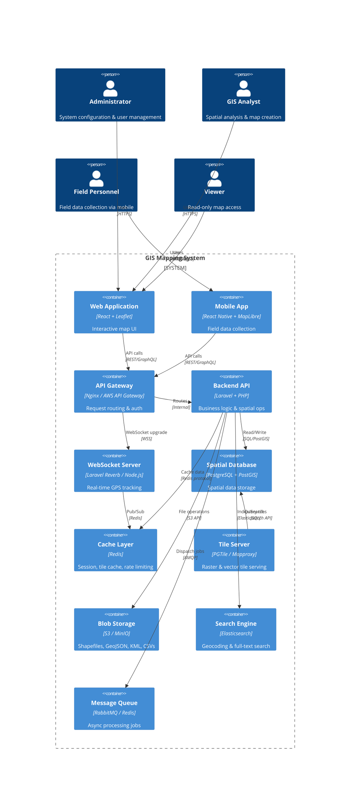

# GIS Mapping System — Architecture Overview

## 1. System Context

The GIS Mapping System is a web-based spatial data management platform that supports interactive mapping, real-time GPS tracking, spatial analysis, role-based access control, and field data collection for mobile teams.

---

## 2. High-Level System Architecture (C4 — Container View)

---

## 3. Technology Stack

| Layer              | Technology                                                       |
| ------------------ | ---------------------------------------------------------------- |
| **Frontend**       | React 18 + TypeScript, Leaflet/MapLibre GL JS, Deck.gl, Turf.js  |
| **Mobile**         | React Native + MapLibre GL, Expo, GPS native modules              |
| **Backend**        | Laravel 11 + PHP 8.3, Spatie/Laravel-Permission, Laravel Horizon  |
| **Spatial DB**     | PostgreSQL 16 + PostGIS 3.4, pgRouting for network analysis      |
| **Tile Server**    | Martin (vector tiles), pg_tileserv, Mapproxy (raster)            |
| **Cache**          | Redis 7 + RedisJSON + RediSearch                                 |
| **Search**         | Elasticsearch 8 + Geo-shapes                                    |
| **Message Queue**  | RabbitMQ 3                                                       |
| **Object Store**   | MinIO (on-prem) / AWS S3 (cloud)                                 |
| **Auth**           | Laravel Sanctum (API tokens) + OAuth 2.0 / OIDC (Keycloak)      |
| **WebSocket**      | Laravel Reverb (scalable WebSockets)                             |
| **Monitoring**     | Prometheus + Grafana, Sentry, ELK stack                          |
| **CI/CD**          | GitHub Actions / GitLab CI, Docker, Kubernetes                   |
| **Infrastructure** | AWS / Azure / On-prem, Terraform / Pulumi                        |

---

## 4. Module Breakdown

### 4.1 Core Modules

| Module                  | Responsibility                                               |
| ----------------------- | ------------------------------------------------------------ |
| **Map Engine**          | Render interactive maps, vector/raster tiles, layer toggling |
| **Layer Manager**       | CRUD for layers, style configuration, ordering, grouping     |
| **Feature Editor**      | Create/edit/delete points, lines, polygons with snapping     |
| **GPS Tracker**         | Real-time location ingestion via WebSocket, track history    |
| **Spatial Analysis**    | Buffer, proximity, route analysis, hotspot detection, area   |
| **Import/Export**       | GeoJSON, KML, Shapefile, CSV, GPX conversion & validation    |
| **Thematic Mapping**    | Choropleth, heatmaps, cluster maps, proportional symbols     |
| **Reporting**           | PDF/CSV report generation, scheduled exports                 |
| **User Management**     | RBAC with granular permissions per layer/feature             |
| **Geocoding**           | Forward/reverse geocoding, address autocomplete              |
| **Audit Trail**         | Full write-ahead logging of all spatial changes              |

---

## 5. Layer Types

| Layer Category       | Examples                                              | Geometry Types   |
| -------------------- | ----------------------------------------------------- | ---------------- |
| Administrative       | Country, state, district, ward boundaries             | MultiPolygon     |
| Roads & Transport    | Highways, streets, rail, pedestrian paths             | MultiLineString  |
| Buildings            | Footprints, floors, entrances                         | MultiPolygon     |
| Land Parcels         | Property boundaries, zoning, ownership                | MultiPolygon     |
| Utilities            | Water pipes, power lines, fiber, sewer, gas           | MultiLineString  |
| Environmental        | Flood zones, vegetation, soil, elevation contours     | Polygon / Line   |
| Custom Layers        | User-defined point markers, sketches, annotations     | Mixed            |

---

## 6. Key Design Decisions

| Decision                     | Rationale                                                              |
| ---------------------------- | ---------------------------------------------------------------------- |
| PostGIS over proprietary DB  | Open-source, mature spatial SQL, extensive indexing (GIST, BRIN)       |
| Vector tiles (MVT)           | High performance, client-side rendering, smaller payload than raster   |
| Laravel + React              | Leverages existing stack, rich ecosystem for permissions & queues      |
| WebSocket for GPS            | Sub-second location updates for field teams                            |
| Elasticsearch for search     | Geospatial queries (geo_shape, geo_distance), autocomplete, fuzzy      |
| Message queue for imports    | Large file processing (Shapefiles) can take minutes — async is needed  |
