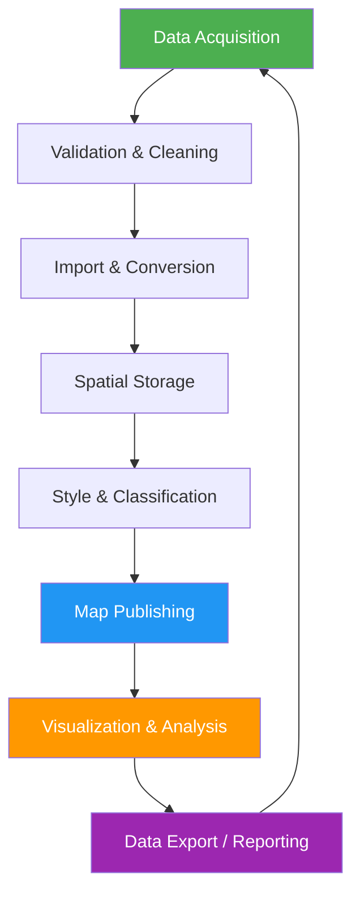
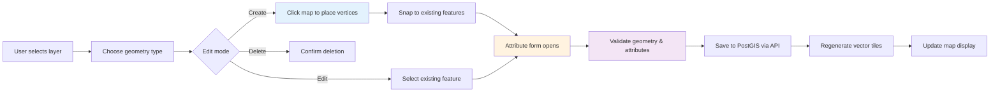
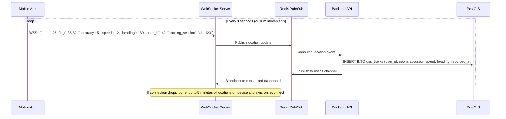

# GIS Mapping System — Workflow Diagrams

## 1. End-to-End GIS Data Lifecycle



---

## 2. Feature Editing Workflow



---

## 3. GPS Tracking Workflow



---

## 4. Import Processing Workflow

```mermaid
flowchart TD
    A[User uploads file] --> B{File type?}
    B -->|GeoJSON| C[Parse GeoJSON]
    B -->|KML| D[Convert KML → GeoJSON]
    B -->|Shapefile (ZIP)| E[Extract .shp, .shx, .dbf, .prj]
    B -->|CSV| F[Parse CSV with lat/lng columns]
    B -->|GPX| G[Parse GPX tracks/waypoints]

    C --> H[Geometry validation]
    D --> H
    E --> H
    F --> H
    G --> H

    H --> I{Valid?}
    I -->|No| J[Return error report with line-level issues]
    I -->|Yes| K[Transform to EPSG:4326]
    K --> L[Assign to target layer]
    L --> M[Dispatch batch insert job to queue]
    M --> N[Insert into PostGIS via COPY command]
    N --> O[Update search index]
    O --> P[Regenerate tile cache]
    P --> Q[Notify user via WebSocket / email]

    style J fill:#f44336,color:#fff
    style Q fill:#4CAF50,color:#fff
```

---

## 5. Spatial Analysis Workflow

```mermaid
flowchart TD
    A[User selects analysis type] --> B{Analysis type}

    B -->|Buffer| C[Select feature + distance]
    C --> D[ST_Buffer(geom, distance)]
    D --> E[Display buffer zone + area stats]

    B -->|Proximity| F[Select feature + radius]
    F --> G[ST_DWithin(feature, target_layer, radius)]
    G --> H[Return intersecting features with distances]

    B -->|Route| I[Select start + end points]
    I --> J[pgr_dijkstra / pgr_astar]
    J --> K[Display route polyline + distance + ETA]

    B -->|Hotspot| L[Select point dataset + bandwidth]
    L --> M[ST_ClusterDBSCAN / Kernel Density Estimation]
    M --> N[Display heatmap overlay + cluster boundaries]

    B -->|Area| O[Select polygon features]
    O --> P[ST_Area(geom) / ST_Perimeter(geom)]
    P --> Q[Display area in sq m, acres, hectares]

    style A fill:#2196F3,color:#fff
    style E fill:#4CAF50,color:#fff
    style H fill:#4CAF50,color:#fff
    style K fill:#4CAF50,color:#fff
    style N fill:#4CAF50,color:#fff
    style Q fill:#4CAF50,color:#fff
```
