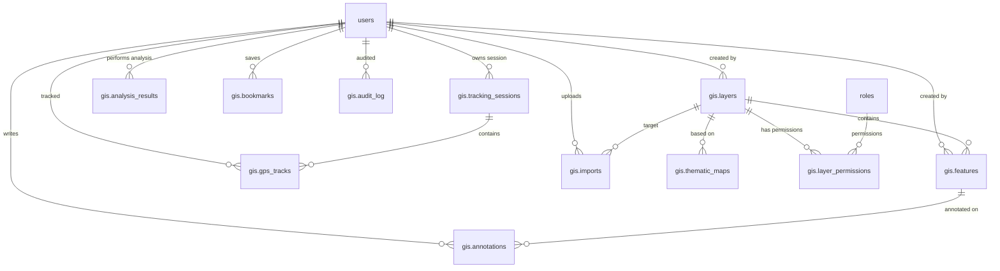

# GIS Mapping System — Spatial Database Schema

## 1. Schema Overview

```
Database: gis_system
Extensions: postgis, postgis_topology, pgrouting, uuid-ossp, btree_gist
```

All spatial columns use **EPSG:4326 (WGS84)** for storage and **EPSG:3857 (Web Mercator)** for tile serving. Area calculations use the geography type for accurate geodesic measurements.

---

## 2. Core Tables

### 2.1 Layers — `gis.layers`

```sql
CREATE TABLE gis.layers (
    id              UUID PRIMARY KEY DEFAULT gen_random_uuid(),
    name            VARCHAR(255) NOT NULL,
    slug            VARCHAR(255) UNIQUE NOT NULL,
    description     TEXT,
    category        VARCHAR(100) NOT NULL DEFAULT 'custom',
    geometry_type   VARCHAR(50) NOT NULL CHECK (geometry_type IN (
                        'Point', 'MultiPoint', 'LineString', 'MultiLineString',
                        'Polygon', 'MultiPolygon', 'GeometryCollection', 'Mixed'
                    )),
    style           JSONB NOT NULL DEFAULT '{}'::jsonb,
    min_zoom        INT DEFAULT 0,
    max_zoom        INT DEFAULT 22,
    is_visible      BOOLEAN DEFAULT true,
    is_editable     BOOLEAN DEFAULT true,
    metadata_schema JSONB DEFAULT '[]'::jsonb,
    created_by      UUID REFERENCES users.id,
    created_at      TIMESTAMPTZ DEFAULT NOW(),
    updated_at      TIMESTAMPTZ DEFAULT NOW()
);

CREATE INDEX idx_layers_category ON gis.layers(category);
CREATE INDEX idx_layers_geometry_type ON gis.layers(geometry_type);
```

### 2.2 Features — `gis.features`

```sql
CREATE TABLE gis.features (
    id              UUID PRIMARY KEY DEFAULT gen_random_uuid(),
    layer_id        UUID NOT NULL REFERENCES gis.layers(id) ON DELETE CASCADE,
    geometry        GEOMETRY NOT NULL,
    properties      JSONB NOT NULL DEFAULT '{}'::jsonb,
    style_override  JSONB DEFAULT NULL,
    external_id     VARCHAR(255),
    source          VARCHAR(100) DEFAULT 'manual',  -- manual, import, gps, api
    version         INT DEFAULT 1,
    created_by      UUID REFERENCES users.id,
    updated_by      UUID REFERENCES users.id,
    created_at      TIMESTAMPTZ DEFAULT NOW(),
    updated_at      TIMESTAMPTZ DEFAULT NOW(),
    deleted_at      TIMESTAMPTZ DEFAULT NULL
);

-- Spatial indexes
CREATE INDEX idx_features_geometry_gist ON gis.features USING GIST (geometry);
CREATE INDEX idx_features_layer_id ON gis.features(layer_id);
CREATE INDEX idx_features_created_by ON gis.features(created_by);
CREATE INDEX idx_features_external_id ON gis.features(external_id);
CREATE INDEX idx_features_properties_gin ON gis.features USING GIN (properties jsonb_path_ops);
CREATE INDEX idx_features_deleted_at ON gis.features(deleted_at);

-- Partial index for active features only
CREATE INDEX idx_features_active ON gis.features(created_at) WHERE deleted_at IS NULL;
```

### 2.3 GPS Tracks — `gis.gps_tracks`

```sql
CREATE TABLE gis.gps_tracks (
    id              BIGSERIAL,
    user_id         UUID NOT NULL REFERENCES users.id,
    tracking_session UUID NOT NULL REFERENCES gis.tracking_sessions(id),
    geom            GEOGRAPHY(Point, 4326) NOT NULL,
    accuracy        REAL,
    altitude        REAL,
    speed           REAL,           -- m/s
    heading         REAL,           -- degrees
    battery_level   SMALLINT,
    recorded_at     TIMESTAMPTZ NOT NULL,
    created_at      TIMESTAMPTZ DEFAULT NOW(),

    -- Partition by month for performance
    CONSTRAINT pk_gps_tracks PRIMARY KEY (id, recorded_at)
) PARTITION BY RANGE (recorded_at);

CREATE INDEX idx_gps_tracks_user_time ON gis.gps_tracks(user_id, recorded_at DESC);
CREATE INDEX idx_gps_tracks_session ON gis.gps_tracks(tracking_session);
CREATE INDEX idx_gps_tracks_geom_gist ON gis.gps_tracks USING GIST (geom);

-- Create monthly partitions
CREATE TABLE gis.gps_tracks_2026_01 PARTITION OF gis.gps_tracks
    FOR VALUES FROM ('2026-01-01') TO ('2026-02-01');
CREATE TABLE gis.gps_tracks_2026_02 PARTITION OF gis.gps_tracks
    FOR VALUES FROM ('2026-02-01') TO ('2026-03-01');
-- ... continues monthly
```

### 2.4 Tracking Sessions — `gis.tracking_sessions`

```sql
CREATE TABLE gis.tracking_sessions (
    id              UUID PRIMARY KEY DEFAULT gen_random_uuid(),
    user_id         UUID NOT NULL REFERENCES users.id,
    label           VARCHAR(255),
    started_at      TIMESTAMPTZ NOT NULL DEFAULT NOW(),
    ended_at        TIMESTAMPTZ,
    total_distance  REAL DEFAULT 0,      -- meters
    avg_speed       REAL DEFAULT 0,
    max_speed       REAL DEFAULT 0,
    is_active       BOOLEAN DEFAULT true,
    metadata        JSONB DEFAULT '{}'::jsonb
);

CREATE INDEX idx_tracking_sessions_user ON gis.tracking_sessions(user_id, started_at DESC);
```

### 2.5 Spatial Analysis Results — `gis.analysis_results`

```sql
CREATE TABLE gis.analysis_results (
    id              UUID PRIMARY KEY DEFAULT gen_random_uuid(),
    type            VARCHAR(50) NOT NULL CHECK (type IN (
                        'buffer', 'proximity', 'route', 'hotspot', 'area',
                        'intersection', 'union', 'difference', 'clip'
                    )),
    name            VARCHAR(255),
    input_layers    UUID[] NOT NULL,
    parameters      JSONB NOT NULL DEFAULT '{}'::jsonb,
    result_geometry GEOMETRY,
    result_properties JSONB DEFAULT '{}'::jsonb,
    statistics      JSONB DEFAULT '{}'::jsonb,
    created_by      UUID REFERENCES users.id,
    created_at      TIMESTAMPTZ DEFAULT NOW()
);

CREATE INDEX idx_analysis_type ON gis.analysis_results(type);
CREATE INDEX idx_analysis_created_by ON gis.analysis_results(created_by);
```

### 2.6 Imports — `gis.imports`

```sql
CREATE TABLE gis.imports (
    id              UUID PRIMARY KEY DEFAULT gen_random_uuid(),
    layer_id        UUID REFERENCES gis.layers(id),
    file_type       VARCHAR(20) NOT NULL CHECK (file_type IN ('geojson', 'kml', 'shapefile', 'csv', 'gpx')),
    original_filename VARCHAR(500) NOT NULL,
    file_size_bytes BIGINT,
    storage_path    VARCHAR(1000),       -- path in S3 / MinIO
    feature_count   INT DEFAULT 0,
    error_count     INT DEFAULT 0,
    errors          JSONB DEFAULT '[]'::jsonb,
    status          VARCHAR(20) DEFAULT 'pending' CHECK (status IN (
                        'pending', 'processing', 'completed', 'failed', 'cancelled'
                    )),
    options         JSONB DEFAULT '{}'::jsonb,   -- column mapping, CRS override
    created_by      UUID REFERENCES users.id,
    created_at      TIMESTAMPTZ DEFAULT NOW(),
    completed_at    TIMESTAMPTZ
);

CREATE INDEX idx_imports_status ON gis.imports(status);
CREATE INDEX idx_imports_created_by ON gis.imports(created_by);
```

### 2.7 Thematic Maps — `gis.thematic_maps`

```sql
CREATE TABLE gis.thematic_maps (
    id              UUID PRIMARY KEY DEFAULT gen_random_uuid(),
    name            VARCHAR(255) NOT NULL,
    description     TEXT,
    type            VARCHAR(50) NOT NULL CHECK (type IN (
                        'choropleth', 'heatmap', 'clustered', 'proportional_symbol',
                        'dot_density', 'bivariate'
                    )),
    layer_id        UUID NOT NULL REFERENCES gis.layers(id),
    configuration   JSONB NOT NULL DEFAULT '{}'::jsonb,
    is_published    BOOLEAN DEFAULT false,
    created_by      UUID REFERENCES users.id,
    created_at      TIMESTAMPTZ DEFAULT NOW(),
    updated_at      TIMESTAMPTZ DEFAULT NOW()
);
```

### 2.8 Audit Log — `gis.audit_log`

```sql
CREATE TABLE gis.audit_log (
    id              BIGSERIAL,
    entity_type     VARCHAR(50) NOT NULL,   -- 'feature', 'layer', 'import', 'analysis'
    entity_id       UUID NOT NULL,
    action          VARCHAR(50) NOT NULL,   -- 'create', 'update', 'delete', 'restore'
    old_values      JSONB DEFAULT NULL,
    new_values      JSONB DEFAULT NULL,
    changes         JSONB DEFAULT NULL,     -- diff of changed fields
    user_id         UUID REFERENCES users.id,
    ip_address      INET,
    user_agent      TEXT,
    recorded_at     TIMESTAMPTZ DEFAULT NOW()
) PARTITION BY RANGE (recorded_at);

CREATE INDEX idx_audit_entity ON gis.audit_log(entity_type, entity_id);
CREATE INDEX idx_audit_user ON gis.audit_log(user_id);
CREATE INDEX idx_audit_action ON gis.audit_log(action);
```

---

## 3. Supporting Tables

### 3.1 Bookmarks — `gis.bookmarks`

```sql
CREATE TABLE gis.bookmarks (
    id              UUID PRIMARY KEY DEFAULT gen_random_uuid(),
    user_id         UUID NOT NULL REFERENCES users.id,
    name            VARCHAR(255) NOT NULL,
    center          GEOGRAPHY(Point, 4326) NOT NULL,
    zoom            INT NOT NULL DEFAULT 10,
    visible_layers  UUID[],
    is_shared       BOOLEAN DEFAULT false,
    created_at      TIMESTAMPTZ DEFAULT NOW()
);
```

### 3.2 Annotations — `gis.annotations`

```sql
CREATE TABLE gis.annotations (
    id              UUID PRIMARY KEY DEFAULT gen_random_uuid(),
    feature_id      UUID REFERENCES gis.features(id) ON DELETE CASCADE,
    layer_id        UUID REFERENCES gis.layers(id) ON DELETE CASCADE,
    user_id         UUID NOT NULL REFERENCES users.id,
    content         TEXT NOT NULL,
    geometry        GEOMETRY,           -- optional spatial reference
    attachments     JSONB DEFAULT '[]'::jsonb,
    resolved_at     TIMESTAMPTZ,
    created_at      TIMESTAMPTZ DEFAULT NOW()
);
```

---

## 4. Permissions Model

```sql
-- Junction table for layer-level permissions
CREATE TABLE gis.layer_permissions (
    id              UUID PRIMARY KEY DEFAULT gen_random_uuid(),
    layer_id        UUID NOT NULL REFERENCES gis.layers(id) ON DELETE CASCADE,
    user_id         UUID REFERENCES users(id) ON DELETE CASCADE,
    role_id         UUID REFERENCES roles(id) ON DELETE CASCADE,
    permissions     TEXT[] NOT NULL DEFAULT '{}' CHECK (
                        permissions <@ ARRAY['view', 'edit', 'delete', 'manage', 'export']
                    ),
    CONSTRAINT layer_perm_owner_check CHECK (
        (user_id IS NOT NULL AND role_id IS NULL) OR
        (user_id IS NULL AND role_id IS NOT NULL)
    ),
    UNIQUE(layer_id, user_id),
    UNIQUE(layer_id, role_id)
);
```

---

## 5. Entity Relationship Diagram



---

## 6. PostGIS Spatial Queries (Examples)

### Buffer Analysis
```sql
SELECT ST_AsGeoJSON(ST_Buffer(f.geometry::geography, :distance_meters)::geometry)
FROM gis.features f
WHERE f.id = :feature_id;
```

### Proximity Search
```sql
SELECT f2.id, f2.properties, ST_Distance(f1.geometry::geography, f2.geometry::geography) AS dist_m
FROM gis.features f1
CROSS JOIN gis.features f2
WHERE f1.id = :target_feature_id
  AND f2.id != f1.id
  AND ST_DWithin(f1.geometry::geography, f2.geometry::geography, :radius_meters)
ORDER BY dist_m;
```

### Route Analysis (pgRouting)
```sql
SELECT seq, node, edge, cost, geom
FROM pgr_dijkstra(
    'SELECT id, source, target, cost, reverse_cost FROM gis.road_network',
    :start_node_id, :end_node_id,
    directed := true
) AS route
JOIN gis.road_network_vertices ON node = id;
```

### Hotspot Detection (DBSCAN)
```sql
SELECT cluster_id, COUNT(*) AS point_count,
       ST_Collect(geom) AS cluster_geom
FROM (
    SELECT ST_ClusterDBSCAN(geom, eps := :distance_meters, minpoints := :min_points)
           OVER () AS cluster_id, geom
    FROM gis.features
    WHERE layer_id = :layer_id AND deleted_at IS NULL
) AS clustered
WHERE cluster_id IS NOT NULL
GROUP BY cluster_id
HAVING COUNT(*) >= :min_points;
```
