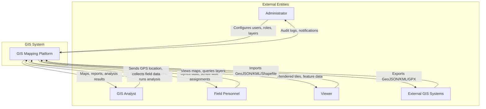
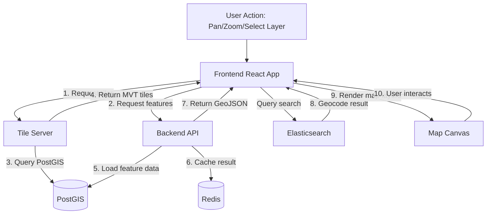
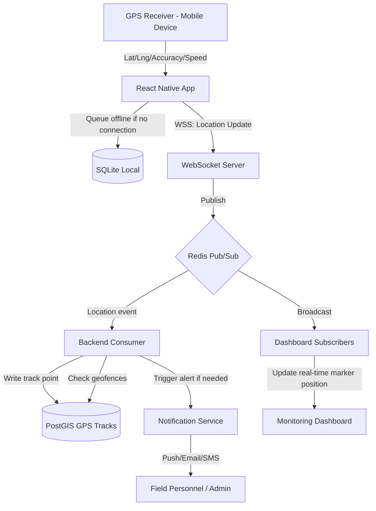
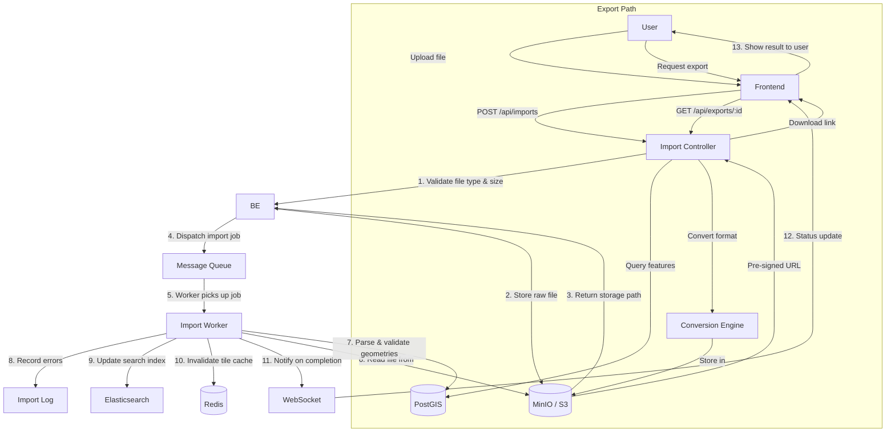
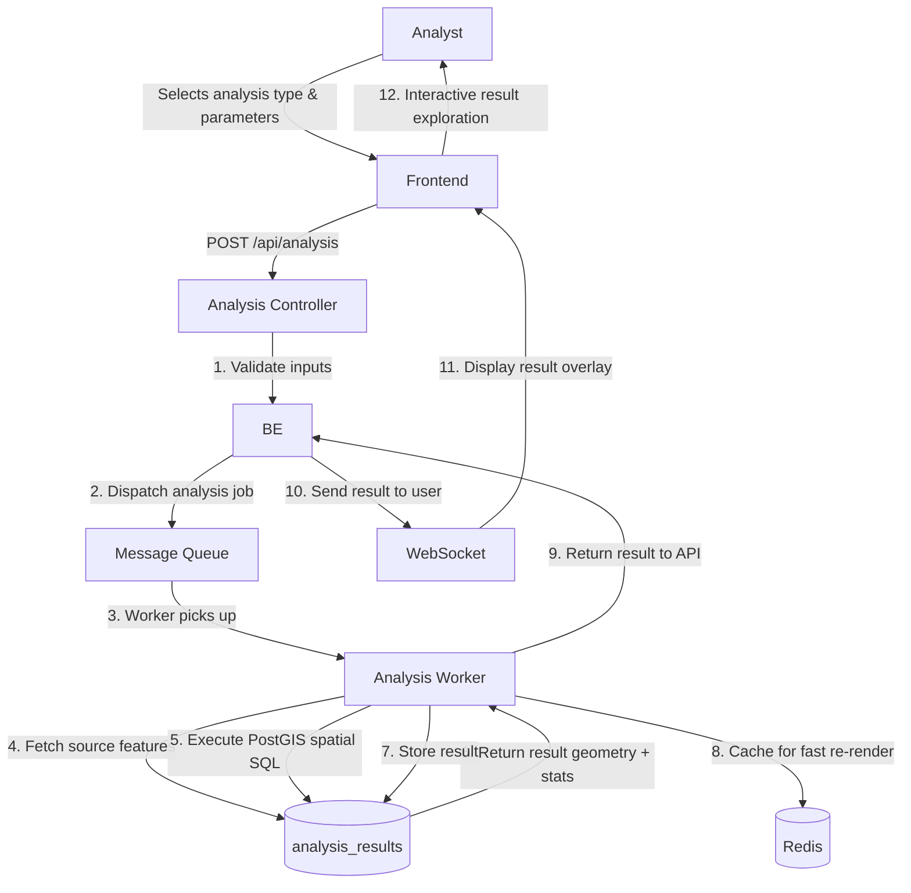

# GIS Mapping System — Data Flow Diagrams

## 1. Context-Level DFD

---

## 2. Level-1 DFD — Map Rendering Flow

---

## 3. Level-1 DFD — GPS Tracking Flow

---

## 4. Level-1 DFD — Import/Export Flow

---

## 5. Level-1 DFD — Spatial Analysis Flow

---

## 6. Data Flow Matrix

| Data Flow             | Source         | Destination    | Protocol    | Frequency   | Payload Size |
| --------------------- | -------------- | -------------- | ----------- | ----------- | ------------ |
| Map Tiles (MVT)       | Tile Server    | Browser        | HTTP/2      | On-demand   | 10-500 KB    |
| Feature CRUD          | Browser        | API            | HTTPS/JSON  | On-demand   | 1-100 KB     |
| GPS Location          | Mobile App     | WebSocket      | WSS         | 3s interval | 200 B        |
| GPS Batch Sync        | Mobile App     | API            | HTTPS/JSON  | On reconnect | 10-500 KB   |
| File Import           | Browser/Mobile | API → MinIO    | HTTPS/Multipart | Weekly   | 1-500 MB     |
| Search Query          | Browser        | Elasticsearch  | HTTPS/JSON  | On-demand   | 1 KB         |
| Analysis Result       | Worker         | Browser (WS)   | WSS/JSON    | On-demand   | 10 KB-10 MB  |
| Audit Events          | API            | PostGIS        | SQL         | Every write | 500 B        |
| Notification          | Backend        | Mobile/Email   | FCM/SMTP    | On event    | 1-10 KB      |
| Auth Token            | API            | Client         | HTTPS/JSON  | Per session | 2 KB         |
