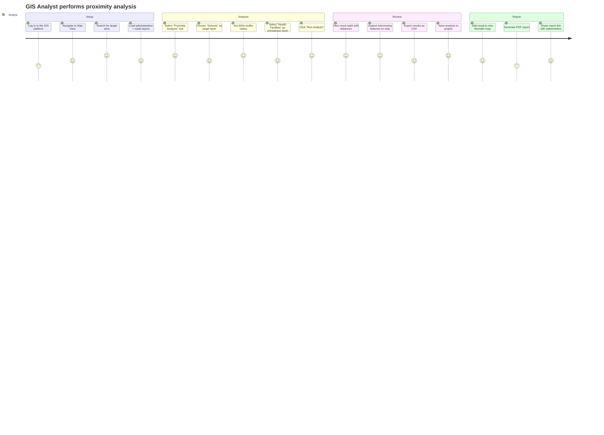
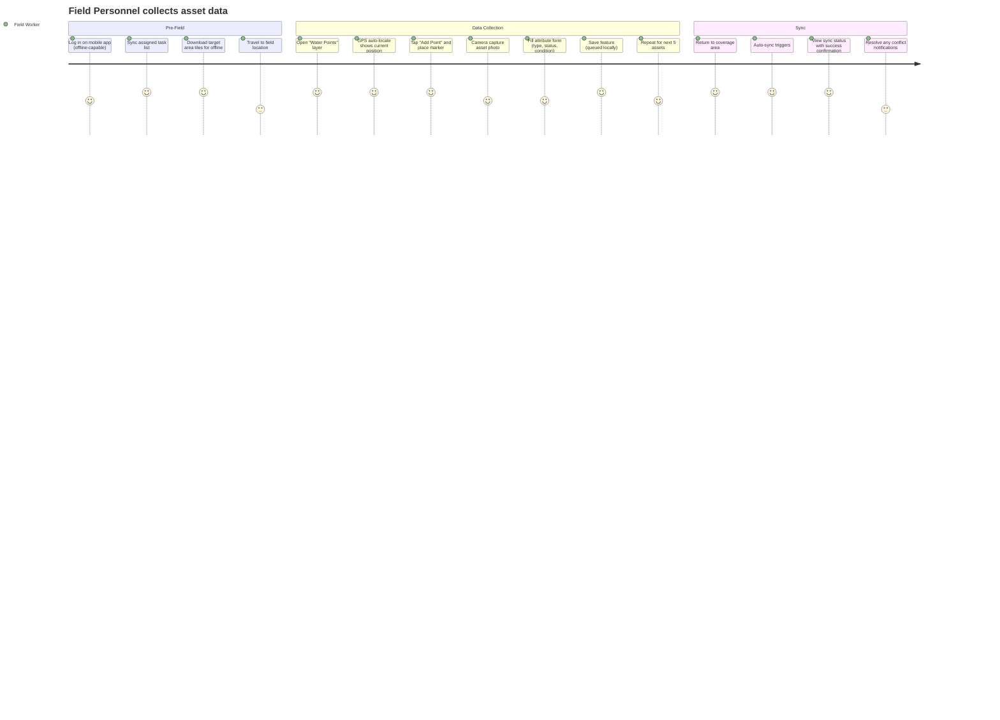
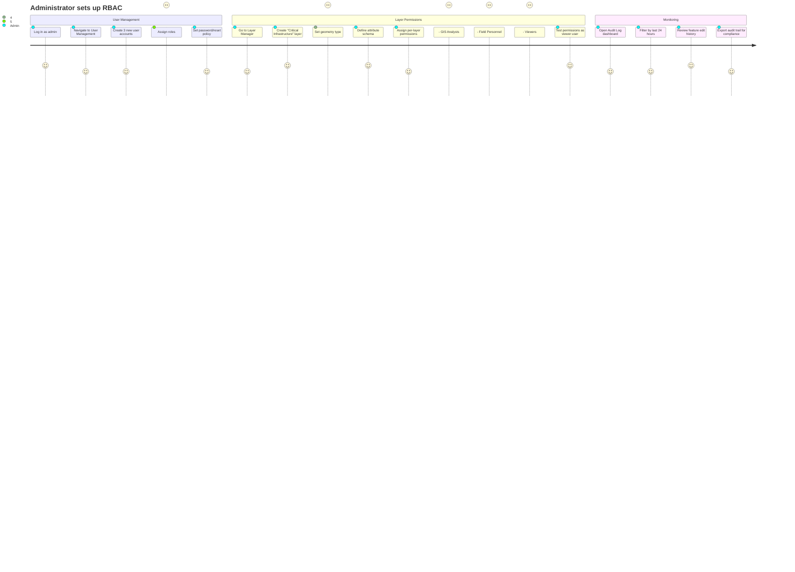
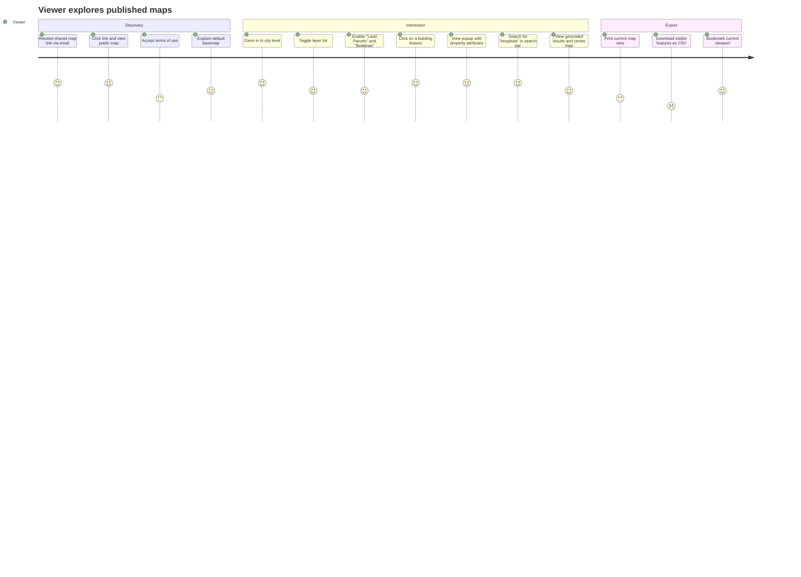

# GIS Mapping System — User Journey Maps

## 1. GIS Analyst — Spatial Analysis Journey

---

## 2. Field Personnel — GPS Data Collection Journey

---

## 3. Administrator — System Configuration Journey

---

## 4. Viewer — Map Exploration Journey

---

## 5. Cross-Cutting User Actions

| Action               | Admin | Analyst | Field | Viewer |
| -------------------- | :---: | :-----: | :---: | :----: |
| View map             |   ✓   |    ✓    |   ✓   |   ✓    |
| Search & geocode     |   ✓   |    ✓    |   ✓   |   ✓    |
| Toggle layers        |   ✓   |    ✓    |   ✓   |   ✓    |
| View feature details |   ✓   |    ✓    |   ✓   |   ✓    |
| Create features      |   ✓   |    ✓    |   ✓   |   ✗    |
| Edit features        |   ✓   |    ✓    |   ✓   |   ✗    |
| Delete features      |   ✓   |    ✓    |   ✗   |   ✗    |
| Spatial analysis     |   ✓   |    ✓    |   ✗   |   ✗    |
| Import data          |   ✓   |    ✓    |   ✓   |   ✗    |
| Export data          |   ✓   |    ✓    |   ✓   |   ✓*   |
| Create layers        |   ✓   |    ✓    |   ✗   |   ✗    |
| Manage permissions   |   ✓   |    ✗    |   ✗   |   ✗    |
| View audit logs      |   ✓   |    ✗    |   ✗   |   ✗    |
| System configuration |   ✓   |    ✗    |   ✗   |   ✗    |

*Export limited to CSV within allowed layers.
