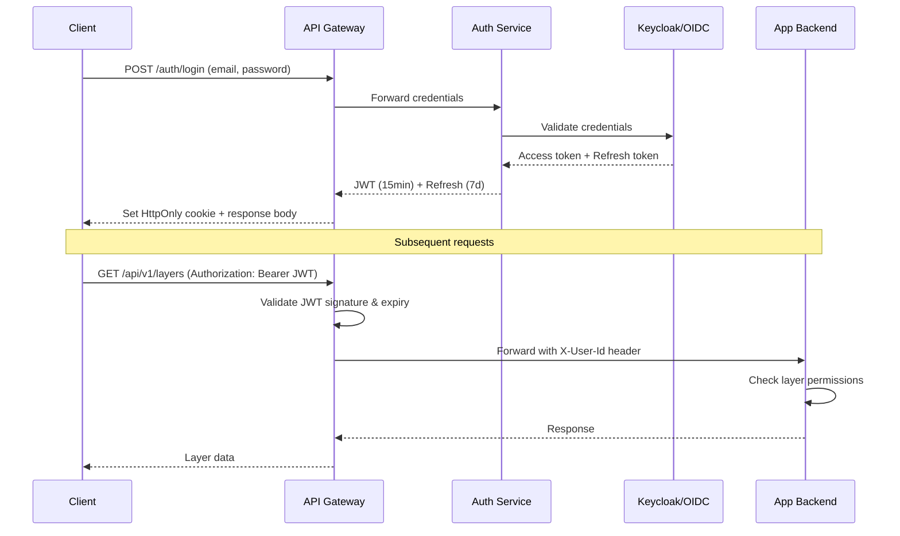
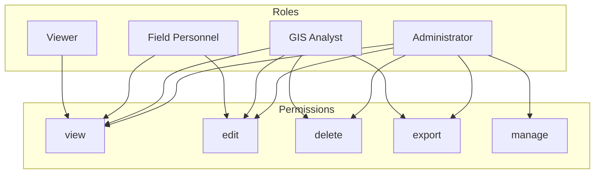
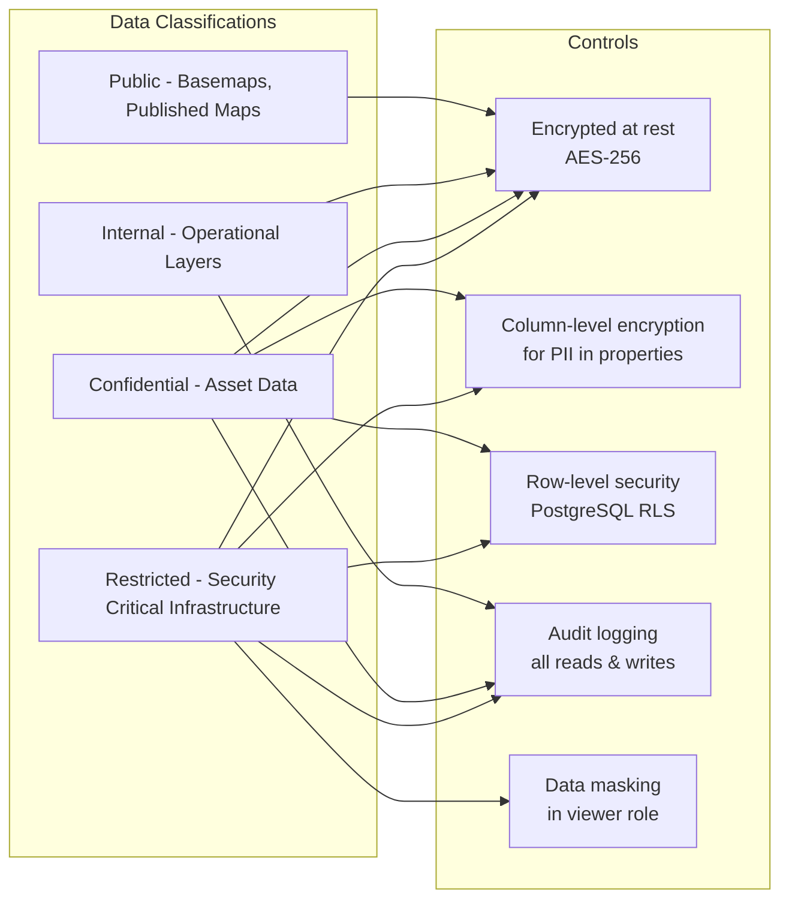
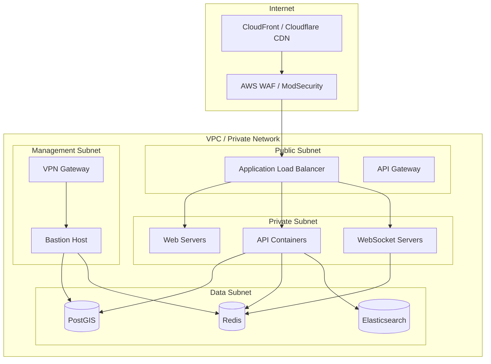

# GIS Mapping System — Security Architecture

## 1. Security Principles

- **Defence in Depth**: Multiple security layers at network, application, and data levels
- **Least Privilege**: Granular per-layer, per-action permissions
- **Zero Trust**: Every request authenticated, authorised, and validated
- **Encrypt at Rest and in Transit**: TLS 1.3 for all communication, AES-256 for stored data
- **Audit Everything**: Immutable audit trail for all spatial data mutations

---

## 2. Authentication Flow



---

## 3. Role-Based Access Control (RBAC)



### 3.1 Permission Matrix

| Operation            | Admin | Analyst | Field | Viewer |
| -------------------- | :---: | :-----: | :---: | :----: |
| View map             |  ✅   |   ✅    |  ✅   |   ✅   |
| View layer list      |  ✅   |   ✅    |  ✅   |   ✅   |
| View feature details |  ✅   |   ✅    |  ✅   |   ✅   |
| Create feature       |  ✅   |   ✅    |  ✅   |   ❌   |
| Edit own features    |  ✅   |   ✅    |  ✅   |   ❌   |
| Edit any feature     |  ✅   |   ✅    |  ❌   |   ❌   |
| Delete feature       |  ✅   |   ✅    |  ❌   |   ❌   |
| Export data          |  ✅   |   ✅    |  ✅   |   ✅*  |
| Run analysis         |  ✅   |   ✅    |  ❌   |   ❌   |
| Create layers        |  ✅   |   ✅    |  ❌   |   ❌   |
| Manage permissions   |  ✅   |   ❌    |  ❌   |   ❌   |
| View audit logs      |  ✅   |   ❌    |  ❌   |   ❌   |
| System config        |  ✅   |   ❌    |  ❌   |   ❌   |

*Viewer export limited to CSV of visible features in public layers.

---

## 4. API Security

| Measure                  | Implementation                                                  |
| ------------------------ | --------------------------------------------------------------- |
| **Rate Limiting**        | Laravel throttle middleware per endpoint group + user tier       |
| **Input Validation**     | Laravel Form Requests with custom geometry validation rules      |
| **SQL Injection**        | Eloquent ORM with parameterised queries for all spatial SQL      |
| **CSRF**                 | SameSite=Strict cookies + XSRF-TOKEN for web, API tokens for SPA |
| **CORS**                 | Whitelist of approved origins                                   |
| **Request Signing**      | HMAC-SHA256 for server-to-server integrations                    |
| **Idempotency**          | Idempotency-Key header on POST/PATCH (prevent duplicate imports) |
| **Payload Size Limit**   | 50MB upload limit, streamed to object store                      |

---

## 5. Data Security



### 5.1 PostgreSQL Row-Level Security

```sql
-- Enable RLS on features table
ALTER TABLE gis.features ENABLE ROW LEVEL SECURITY;

-- Viewer: can only see non-deleted features in visible layers
CREATE POLICY viewer_select ON gis.features FOR SELECT TO viewer_role
USING (
    deleted_at IS NULL
    AND layer_id IN (
        SELECT layer_id FROM gis.layer_permissions
        WHERE permissions @> ARRAY['view']
        AND (user_id = current_user_id() OR role_id IN (SELECT role_id FROM user_roles))
    )
);

-- Field Personnel: can see + edit own features, and edit any feature in assigned layers
CREATE POLICY field_update ON gis.features FOR UPDATE TO field_role
USING (
    deleted_at IS NULL
    AND layer_id IN (SELECT layer_id FROM gis.layer_permissions WHERE permissions @> ARRAY['edit'])
)
WITH CHECK (
    created_by = current_user_id()
    OR layer_id IN (SELECT layer_id FROM gis.layer_permissions WHERE permissions @> ARRAY['edit'])
);
```

---

## 6. Network Security



---

## 7. Security Monitoring & Incident Response

| Area                   | Tool / Implementation                                         |
| ---------------------- | ------------------------------------------------------------- |
| **WAF**                | AWS WAF / Cloudflare — block SQLi, XSS, DDoS                  |
| **IDS/IPS**            | Snort / Suricata — network-level threat detection              |
| **SIEM**              | Wazuh / ELK Stack — log aggregation, alerting                 |
| **Vulnerability Scan** | Trivy (containers), OWASP ZAP (web app), Lynis (hosts)        |
| **Secrets Management** | HashiCorp Vault / AWS Secrets Manager                         |
| **Container Security** | Docker content trust, image signing, runtime security (Falco) |
| **Backup & DR**        | pgBackRest (WAL archiving), cross-region replication           |
| **Incident Response**  | On-call rotation, runbooks, post-mortem process                |

---

## 8. Compliance Considerations

| Requirement | Implementation |
| ----------- | -------------- |
| GDPR        | Data classification, PII masking, right-to-erasure API, consent management |
| ISO 27001   | Access control policy, change management, incident management |
| SOC 2       | Audit logging, encryption, availability monitoring, penetration testing |
| Local GIS Laws | CRS standards (EPSG:4326), metadata standards (ISO 19115), data sovereignty controls |
