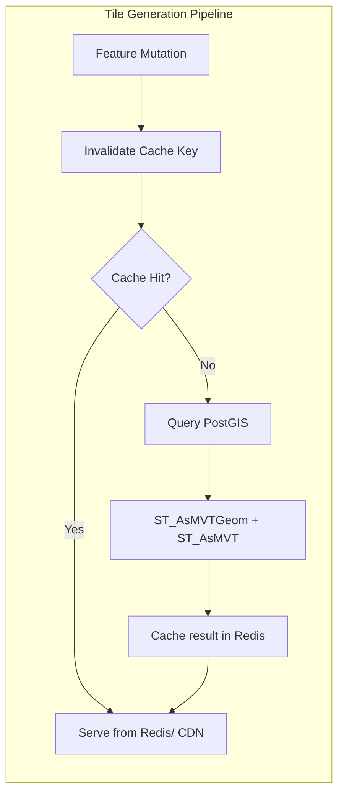
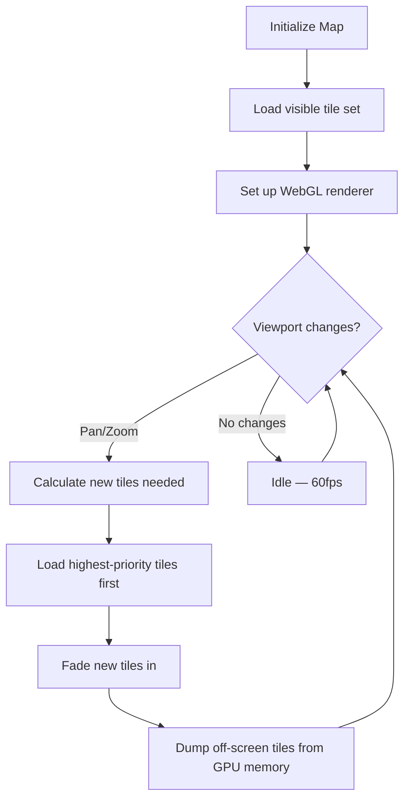
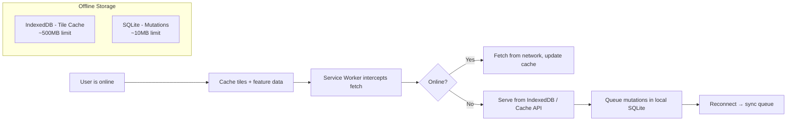

# GIS Mapping System — Performance Optimization Strategies

## 1. Database Performance

### 1.1 Spatial Indexing Strategy

| Index Type   | Use Case                       | Performance Gain         |
| ------------ | ------------------------------ | ------------------------ |
| GIST (GiST)  | General spatial queries (bbox, intersects, within) | 100-1000x vs sequential scan |
| BRIN         | Large append-only tables (GPS tracks) with natural ordering | 10-100x, 100x smaller than GIST |
| SP-GiST      | Point-only datasets with kNN queries | 2-5x faster for nearest-neighbour |
| Partial GIST | Filtered index on `deleted_at IS NULL` | Reduces index size by 40-60% |

### 1.2 Query Optimisation

```sql
-- BAD: Full table scan with function call
SELECT * FROM gis.features
WHERE ST_Intersects(geometry, ST_MakeEnvelope(:bbox));

-- GOOD: Use && bounding box pre-filter + ST_Intersects for precision
SELECT * FROM gis.features
WHERE geometry && ST_MakeEnvelope(:bbox)
  AND ST_Intersects(geometry, ST_MakeEnvelope(:bbox));

-- BAD: geography cast on every row
SELECT * FROM gis.features
WHERE ST_DWithin(geometry::geography, :target::geography, 1000);

-- GOOD: Indexed geography column pre-cast
SELECT * FROM gis.features
WHERE geom_geography && ST_Buffer(:target::geography, 1000)
  AND ST_DWithin(geom_geography, :target::geography, 1000);
```

### 1.3 Table Partitioning

| Table               | Partition Key   | Interval     | Max Rows/Partition | Benefit                       |
| ------------------- | --------------- | ------------ | ------------------ | ----------------------------- |
| `gis.gps_tracks`   | `recorded_at`   | Monthly      | ~10M               | Fast time-range queries, easy archival |
| `gis.audit_log`    | `recorded_at`   | Monthly      | ~5M                | Retention policy via DROP PARTITION |
| `gis.features`     | `layer_id`      | By layer     | Varies             | Layer-specific queries hit one partition |

### 1.4 Vacuum & Maintenance

```
-- Scheduled cron jobs (via pg_cron or external scheduler)

-- Every 5 minutes: Autovacuum threshold check (already automatic)
-- Daily 02:00: REINDEX CONCURRENTLY on high-churn indexes
-- Daily 03:00: CLUSTER gis.features USING idx_features_layer_id (reorder by layer)
-- Weekly: ANALYZE on all spatial tables
-- Monthly: DROP old GPS track partitions (>12 months to archival tablespace)
```

---

## 2. Tile Serving Optimisation

### 2.1 Vector Tiles (MVT)



| Tactic                          | Implementation                                                   |
| ------------------------------- | ---------------------------------------------------------------- |
| **Tile caching**               | Redis with 24h TTL + CDN edge caching (CloudFront, 7d TTL)      |
| **Geometry simplification**     | `ST_Simplify(geom, tolerance)` — zoom-dependent tolerance        |
| **Dynamic tile expiration**     | Subscribe to feature mutations, invalidate only affected tiles    |
| **MVT generation**              | Pre-processed static tiles for basemaps, on-demand for dynamic   |
| **Client-side caching**         | TileJSON cache headers: `Cache-Control: public, max-age=86400`   |
| **CDN warmup**                  | Pre-generate tiles for common zoom levels on publish             |

### 2.2 MVT Query Template (Zoom-Optimised)

```sql
WITH bounds AS (
    SELECT ST_TileEnvelope(:z, :x, :y) AS geom
)
SELECT ST_AsMVT(tile, 'layer', 4096, 'mvtgeom') AS mvt
FROM (
    SELECT
        f.id,
        f.properties,
        ST_AsMVTGeom(
            ST_SimplifyPreserveTopology(f.geometry, :simplify_tolerance),
            bounds.geom,
            4096, 256, true
        ) AS mvtgeom
    FROM gis.features f, bounds
    WHERE f.geometry && bounds.geom
      AND f.deleted_at IS NULL
      AND f.layer_id = :layer_id
      AND ST_Intersects(f.geometry, bounds.geom)
      -- Zoom-based filtering
      AND (
          (:z < 10 AND ST_GeometryType(f.geometry) NOT IN ('ST_Point', 'ST_MultiPoint'))
          OR (:z >= 10)
      )
) AS tile;
```

---

## 3. Application Layer Optimisation

### 3.1 Caching Strategy

```
┌─────────────────────────────────────────────────────────────────┐
│                        CACHE LAYERS                             │
├──────────────┬────────────────────┬──────────────┬─────────────┤
│  L1: Browser │   L2: CDN Edge    │  L3: Redis   │  L4: DB     │
│  Cache       │   Cache           │  Cache       │  Query      │
├──────────────┼────────────────────┼──────────────┼─────────────┤
│ Static assets│ Basemap tiles     │ Layer config │ Uncacheable │
│ TileJSON     │ Published maps    │ Feature cache│ spatial SQL  │
│ Fonts        │ Exported files    │ Tile cache   │ Analytics   │
│              │ Geocoding results │ Session data │ Audit write │
│              │                   │ Rate limiter │             │
│ TTL: 7d      │ TTL: 24h-7d      │ TTL: 5min-1h │ N/A         │
│ Cache: ~50MB │ Cache: ~10GB     │ Cache: ~8GB  │             │
└──────────────┴────────────────────┴──────────────┴─────────────┘
```

### 3.2 API Response Optimisation

| Optimisation              | Technique                                                     |
| ------------------------- | ------------------------------------------------------------- |
| **GeoJSON simplification**| `ST_Simplify` on geometry before serialisation (zoom-dependent) |
| **Partial responses**     | `?fields=name,status` — only return requested properties       |
| **Pagination**            | Cursor-based for large feature sets (no OFFSET)                |
| **Conditional requests**  | `ETag` + `If-None-Match` headers on feature responses          |
| **Compression**           | Brotli (level 5) for API responses, ZSTD for tiles             |
| **Batch endpoints**       | Batch feature create/update (up to 500 per request)            |
| **Database read replicas**| Read-only replicas for tile + search queries                   |

### 3.3 Laravel-Specific Optimisation

```
# Cache spatial queries
$features = Cache::remember("layer.{$layerId}.bbox.{$bboxHash}", 300, function () {
    return Feature::whereInBbox($bbox)->get();
});

# Use chunked queries for large exports
Feature::whereLayerId($layerId)->chunk(1000, function ($features) use ($writer) {
    foreach ($features as $feature) {
        $writer->writeFeature($feature->toGeoJSON());
    }
});

# Queue heavy operations
ProcessImport::dispatch($importId)->onQueue('imports');
RunAnalysis::dispatch($analysisId)->onQueue('analysis');

# Read-write split (Laravel DB read/write connections)
'read' => [
    'host' => env('DB_READ_HOST', env('DB_HOST')),
],
'write' => [
    'host' => env('DB_WRITE_HOST', env('DB_HOST')),
],
```

---

## 4. Frontend Optimisation

### 4.1 Map Rendering Performance



| Issue                       | Solution                                                             |
| --------------------------- | -------------------------------------------------------------------- |
| **Too many features**       | Clustering at low zoom, simplification, viewport-only loading        |
| **Large GeoJSON responses** | Use MVT vector tiles instead of GeoJSON for map rendering            |
| **Slow popups**             | Lazy-load attribute data only when feature is clicked                |
| **Memory leaks**            | Proper cleanup of tile layers, event listeners on unmount            |
| **Canvas repaint**          | Use `requestAnimationFrame` throttling for continuous interactions   |
| **Bundle size**             | Code-split MapLibre/Leaflet + plugins, tree-shake unused features    |

### 4.2 Offline Strategy (Mobile)



---

## 5. Scaling Strategy

### 5.1 Horizontal Scaling

| Component       | Scaling Strategy                      | Max Load Per Node         |
| --------------- | ------------------------------------- | ------------------------- |
| Web Servers     | K8s HPA — CPU > 70% or req/s > 1000  | 1000 req/s                |
| API Containers  | K8s HPA — queue depth, response time  | 500 req/s                 |
| WebSocket       | Sticky sessions + Redis Pub/Sub backplane | 10K connections/node  |
| PostGIS         | Read replicas (3x), write master      | 50K QPS read, 5K QPS write|
| Redis           | Redis Cluster (6 shards + 3 replicas) | 100K ops/s                |
| Tile Server     | CDN offload, auto-scale on zoom level | 10K tile reqs/s           |

### 5.2 Estimated Capacity (Single K8s Pod — 4 vCPU, 8GB RAM)

| Operation                | Throughput         | P99 Latency |
| ------------------------ | ------------------ | ----------- |
| Tile request (MVT)       | 500 req/s          | 50ms        |
| Feature create (point)   | 200 req/s          | 100ms       |
| Feature query by bbox    | 50 req/s           | 200ms       |
| Proximity analysis (1000 features) | 10 req/s  | 2s          |
| GPS location insert      | 1000 req/s         | 20ms        |
| Import (10K features)    | 1 job/30s          | 30s         |
| Full-text search          | 100 req/s          | 50ms        |

---

## 6. Database Configuration (PostgreSQL + PostGIS)

```
# postgresql.conf — Performance Tuning

shared_buffers = 4GB                 # 25% of RAM
effective_cache_size = 12GB          # 75% of RAM
work_mem = 64MB                      # Per-operation sort memory
maintenance_work_mem = 1GB           # VACUUM, CREATE INDEX
wal_buffers = 64MB
random_page_cost = 1.1              # SSD-optimised
effective_io_concurrency = 200       # SSD
max_parallel_workers_per_gather = 4
max_parallel_workers = 8
max_worker_processes = 12

# PostGIS settings
postgis.gist_page_per_ge = 0.2      # Faster GiST index builds
postgis.enable_transform = ON        # Cache CRS transforms

# Partitioning
enable_partition_pruning = ON
```

---

## 7. Monitoring & Observability

| Signal              | Tool              | Alert Threshold                  |
| ------------------- | ----------------- | -------------------------------- |
| Tile response time  | Grafana           | P99 > 500ms for 5min             |
| API error rate      | Sentry + Grafana  | > 1% errors over 5min            |
| DB connection pool  | pgBouncer metrics | > 80% utilised                   |
| Import queue depth  | Laravel Horizon   | > 100 pending for 10min          |
| GPS throughput      | Redis metrics     | < 50% of expected GPS devices     |
| Disk space          | Prometheus node exporter | > 85% utilisation          |
| CDN cache hit ratio | CloudFront logs   | < 80% for tile requests          |
