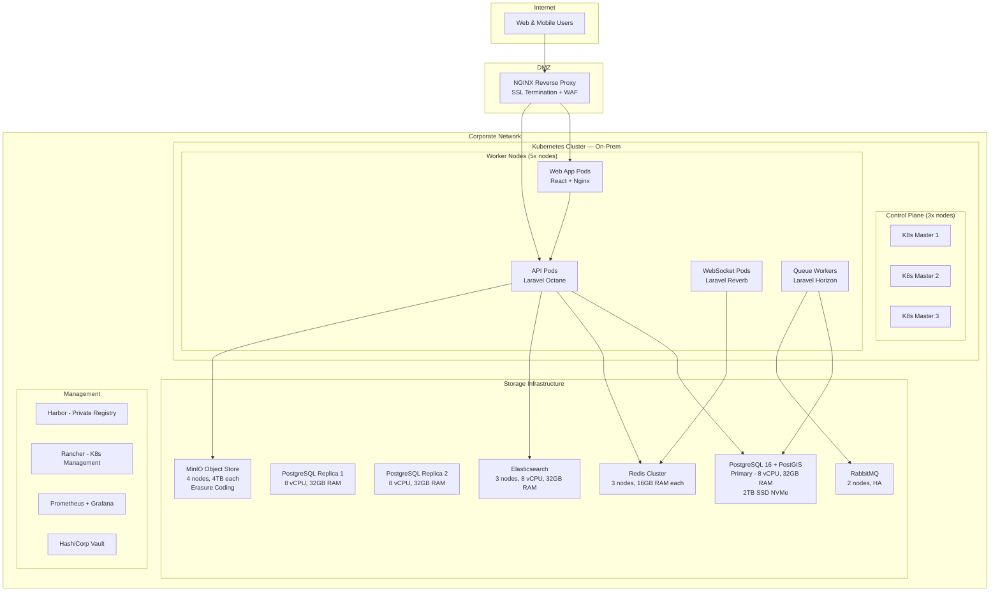

# GIS Mapping System — Deployment Architecture

## 1. Cloud Deployment (AWS)

```mermaid
graph TB
    subgraph "AWS Global"
        CF[CloudFront CDN]
        WAF[AWS WAF]
        R53[Route 53]
    end

    subgraph "AWS Region: eu-west-1"
        subgraph "VPC — Production"
            subgraph "Public Subnets (AZ a, b, c)"
                ALB[ALB - Application Load Balancer]
            end

            subgraph "Private Subnets — App Tier"
                ECS_ECS1[ECS Fargate - Web App<br>2x CPU, 4GB RAM<br>Min: 2, Max: 20]
                ECS_ECS2[ECS Fargate - API<br>4x CPU, 8GB RAM<br>Min: 3, Max: 30]
                ECS_ECS3[ECS Fargate - Workers<br>2x CPU, 4GB RAM<br>Min: 2, Max: 10]
                ECS_ECS4[ECS Fargate - WebSocket<br>4x CPU, 8GB RAM<br>Min: 2, Max: 10]
            end

            subgraph "Private Subnets — Data Tier"
                RDS_AURORA[Aurora PostgreSQL<br>+ PostGIS<br>Writer: db.r6g.large<br>Readers: 2x db.r6g.large]
                ELASTICACHE[ElastiCache Redis<br>Cluster: 3 shards<br>2 replicas each]
                OPENSEARCH[OpenSearch<br>3 x m6g.large.search<br>1 replica per index]
                MQ[Amazon MQ for RabbitMQ<br>mq.m5.large<br>Active/Standby]
            end

            subgraph "Storage Subnets"
                S3_GIS[S3 Bucket<br>gis-system-{env}-assets<br>Versioning + Lifecycle]
                EFS_EFS[EFS<br>Shared tile cache]
            end
        end

        subgraph "Management"
            BASTION[Bastion Host<br>t3.nano]
            CICD[CodePipeline + CodeBuild]
            CLOUDWATCH[CloudWatch + Grafana]
            SECRETS[Secrets Manager]
        end
    end

    R53 --> CF
    CF --> WAF
    WAF --> ALB
    ALB --> ECS_ECS1
    ALB --> ECS_ECS2
    ALB --> ECS_ECS4
    ECS_ECS2 --> RDS_AURORA
    ECS_ECS2 --> ELASTICACHE
    ECS_ECS2 --> OPENSEARCH
    ECS_ECS2 --> S3_GIS
    ECS_ECS3 --> RDS_AURORA
    ECS_ECS3 --> MQ
    ECS_ECS4 --> ELASTICACHE
    ECS_ECS1 --> ELASTICACHE
    BASTION --> RDS_AURORA
    SECRETS --> ECS_ECS1
    SECRETS --> ECS_ECS2
```

---

## 2. On-Premise Deployment



---

## 3. Kubernetes Deployment Topology

```yaml
# gis-api-deployment.yaml (snippet)
apiVersion: apps/v1
kind: Deployment
metadata:
  name: gis-api
spec:
  replicas: 3
  selector:
    matchLabels:
      app: gis-api
  template:
    metadata:
      labels:
        app: gis-api
    spec:
      containers:
      - name: api
        image: gis-system/api:latest
        ports:
        - containerPort: 8080
        env:
        - name: DB_HOST
          valueFrom:
            secretKeyRef:
              name: gis-db-credentials
              key: host
        - name: DB_DATABASE
          value: gis_system
        - name: REDIS_CLUSTER
          value: "redis-cluster:6379"
        - name: S3_ENDPOINT
          value: "http://minio:9000"
        resources:
          requests:
            cpu: "2"
            memory: "4Gi"
          limits:
            cpu: "4"
            memory: "8Gi"
        livenessProbe:
          httpGet:
            path: /api/v1/health
            port: 8080
          initialDelaySeconds: 30
        readinessProbe:
          httpGet:
            path: /api/v1/health/ready
            port: 8080
---
apiVersion: autoscaling/v2
kind: HorizontalPodAutoscaler
metadata:
  name: gis-api-hpa
spec:
  scaleTargetRef:
    apiVersion: apps/v1
    kind: Deployment
    name: gis-api
  minReplicas: 3
  maxReplicas: 30
  metrics:
  - type: Resource
    resource:
      name: cpu
      target:
        type: Utilization
        averageUtilization: 70
  - type: Resource
    resource:
      name: memory
      target:
        type: Utilization
        averageUtilization: 80
```

---

## 4. CI/CD Pipeline

```mermaid
flowchart LR
    A[Developer Push to GitHub] --> B[GitHub Actions Trigger]

    subgraph "CI Stage"
        B --> C[Checkout Code]
        C --> D[Install Dependencies]
        D --> E[Run Lint + Static Analysis]
        E --> F[Run Unit Tests]
        F --> G[Run Feature Tests]
        G --> H[Build Docker Images]
        H --> I[Push to Registry]
    end

    subgraph "CD Stage"
        I --> J{Environment}
        J -->|Staging| K[Deploy to Staging K8s]
        J -->|Production| L[Approval Gate]
        L --> M[Deploy to Production K8s]
        K --> N[Run Smoke Tests]
        M --> O[Run Smoke Tests]
        N --> P[Tag Release]
        O --> P
    end

    subgraph "Post-Deploy"
        P --> Q[Run DB Migrations]
        Q --> R[Invalidate CDN Cache]
        R --> S[Notify Team via Slack]
        S --> T[Update Sentry Releases]
    end
```



---

## 5. Environment Strategy

| Environment | Purpose                    | Infra Size            | Data          | Access                 |
| ----------- | -------------------------- | --------------------- | ------------- | ---------------------- |
| **Dev**     | Development, local testing | Docker Compose (1 node) | Synthetic data | Dev team               |
| **Staging** | Integration, QA, UAT       | Mini K8s (3 nodes)     | Anonymised copy | QA + Stakeholders     |
| **Production** | Live system             | Full HA K8s (5+ nodes) | Real data     | All users + field teams |
| **DR**      | Disaster recovery          | Standby in secondary region/DC | WAL replication | Ops team (on failover) |

---

## 6. Infrastructure as Code (Terraform)

```hcl
# terraform/aws/main.tf (snippet)
module "vpc" {
  source = "terraform-aws-modules/vpc/aws"
  name   = "gis-${var.environment}"
  cidr   = "10.0.0.0/16"

  azs             = ["eu-west-1a", "eu-west-1b", "eu-west-1c"]
  private_subnets = ["10.0.1.0/24", "10.0.2.0/24", "10.0.3.0/24"]
  public_subnets  = ["10.0.101.0/24", "10.0.102.0/24", "10.0.103.0/24"]

  enable_nat_gateway   = true
  single_nat_gateway   = false
  enable_dns_hostnames = true
}

module "aurora_postgresql" {
  source = "terraform-aws-modules/rds-aurora/aws"

  name                   = "gis-${var.environment}"
  engine                 = "aurora-postgresql"
  engine_version         = "16.3"
  instance_class         = "db.r6g.large"
  instances              = { 1: {}, 2: {}, 3: {} }
  vpc_id                 = module.vpc.vpc_id
  subnet_ids             = module.vpc.database_subnets
  allowed_security_groups = [module.api_sg.security_group_id]

  storage_encrypted   = true
  deletion_protection = true
  skip_final_snapshot = false

  apply_immediately   = false
  enabled_cloudwatch_logs_exports = ["postgresql"]
}
```

---

## 7. Backup & Disaster Recovery

| Asset                   | Backup Method                             | RPO      | RTO       | Retention              |
| ----------------------- | ----------------------------------------- | -------- | --------- | ---------------------- |
| **PostGIS**             | pgBackRest — full daily + WAL streaming   | 5 min    | 1 hour    | Daily: 30d, Weekly: 12w, Monthly: 12m |
| **S3/MinIO Objects**    | Cross-region replication + versioning     | 1 min    | 30 min    | Versioning: 90 days    |
| **Elasticsearch**       | Snapshot to S3 every 6 hours              | 6 hours  | 2 hours   | 14 days                |
| **Redis**               | RDB snapshots every hour + AOF            | 1 hour   | 15 min    | 7 days                 |
| **Configuration**       | Terraform state in S3 (versioned)         | Real-time | 30 min   | Indefinite             |
| **Docker Images**       | Registry mirror in DR region              | Per push  | 10 min   | 90 days                |

### DR Runbook (RTO: 4 hours, RPO: 15 min)

```mermaid
flowchart TD
    A[Primary Region Failure Detected] --> B{Automatic failover?}
    B -->|Yes| C[DNS switch Route 53 to DR region]
    B -->|No (manual)| D[Operator confirms incident]
    D --> E[Run terraform apply on DR workspace]
    E --> F[Promote Aurora read replica in DR]
    F --> G[Restore Redis from last RDB]
    G --> H[Point ECS to DR resources]
    H --> I[Switch Route 53 weighted record]
    I --> J[Validate system health checks]
    J --> K[Notify stakeholders]

    C --> J
```

---

## 8. Cost Estimates (Monthly — AWS Production)

| Service               | Configuration                                | Monthly Cost |
| --------------------- | -------------------------------------------- | ------------ |
| ECS Fargate           | 8 API + 4 Web + 4 Worker + 4 WS (avg)        | ~$2,800      |
| Aurora PostgreSQL     | 1 writer + 2 readers, db.r6g.large           | ~$1,500      |
| ElastiCache Redis     | 3 shards, 2 replicas, r6g.large              | ~$900        |
| OpenSearch            | 3 x m6g.large.search                         | ~$600        |
| S3                    | 2TB data + cross-region replication           | ~$200        |
| CloudFront            | 10TB transfer                                | ~$800        |
| RabbitMQ              | mq.m5.large active/standby                   | ~$400        |
| NAT Gateway           | 3x NAT Gateways                              | ~$100        |
| ALB                   | 1 ALB + idle capacity                        | ~$50         |
| Monitoring (Grafana, Sentry, etc.) |                              | ~$300        |
| **Total**             |                                              | **~$7,650**  |

On-premise costs vary by hardware; estimate: **~$30,000–50,000 CAPEX** + **$2,000–3,000/month OPEX** (power, cooling, admin).

---

## 9. Local Development Environment

```yaml
# docker-compose.yml (snippet)
version: "3.9"
services:
  app:
    image: gis-system/app:dev
    build:
      context: .
      dockerfile: Dockerfile
    ports:
      - "3000:3000"   # React Vite dev server
    volumes:
      - .:/app
      - /app/node_modules
    environment:
      - VITE_API_URL=http://localhost:8080

  api:
    image: gis-system/api:dev
    build:
      context: ./backend
      dockerfile: Dockerfile.dev
    ports:
      - "8080:8080"
    volumes:
      - ./backend:/var/www
    environment:
      - DB_HOST=postgis
      - REDIS_HOST=redis
      - ELASTICSEARCH_HOST=elasticsearch
      - S3_ENDPOINT=http://minio:9000
      - S3_KEY=minioadmin
      - S3_SECRET=minioadmin

  postgis:
    image: postgis/postgis:16-3.4
    ports:
      - "5432:5432"
    volumes:
      - pgdata:/var/lib/postgresql/data
      - ./database/init:/docker-entrypoint-initdb.d
    environment:
      POSTGRES_DB: gis_system
      POSTGRES_USER: gis
      POSTGRES_PASSWORD: secret

  redis:
    image: redis/redis-stack:7.2
    ports:
      - "6379:6379"
      - "8001:8001"

  elasticsearch:
    image: docker.elastic.co/elasticsearch/elasticsearch:8.12
    ports:
      - "9200:9200"
    environment:
      - discovery.type=single-node
      - xpack.security.enabled=false

  minio:
    image: minio/minio:latest
    ports:
      - "9000:9000"
      - "9001:9001"
    command: server /data --console-address ":9001"
    volumes:
      - miniodata:/data
    environment:
      MINIO_ROOT_USER: minioadmin
      MINIO_ROOT_PASSWORD: minioadmin

volumes:
  pgdata:
  miniodata:
```
